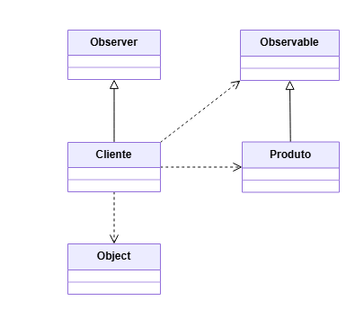

# Implementação do Padrão de Projeto: Observer

O Observer é um padrão de projeto comportamental que define uma dependência um-para-muitos entre objetos, de modo que quando um objeto muda de estado, todos os seus dependentes são notificados e atualizados automaticamente.

Os componentes principais do padrão são:

- **Observable:** O objeto que detém o estado de interesse. Ele mantém uma lista de seus dependentes (Observers) e notifica todos eles sobre qualquer mudança de estado
- **Observer:**  O objeto dependente que deseja ser notificado sobre as mudanças no Subject. Ele implementa um método de atualização (update) que é chamado pelo Subject


## Cenário Aplicado: Sistema de Notificações de E-commerce
Para esta implementação, foi escolhido o cenário de um sistema de notificações de E-commerce. A ideia é que os clientes possam "assinar" um produto de interesse e serem notificados automaticamente quando houver mudanças importantes, como uma alteração de preço ou a reposição de estoque.

A estrutura ficou definida da seguinte forma:
- Subject (Observable): Produto (Notifica os clientes sobre alterações de preço ou estoque)
- Observer: Cliente (Assina o produto e recebe a notificação, registrando a última mensagem recebida)

### Estrutura do Projeto
O projeto foi organizado utilizando a estrutura padrão do Maven.

```
├──pom.xml
└──src/
    ├── main/java/padroescomportamentais/observer/
    │   └── Produti.java               # Observable
    │   └── Cliente.java               # Observer
    └── test/java/padroescomportamentais/observer/
        └── ClienteTest.java  
```

### Diagrama


### Tecnologias Utilizadas
- Java 11: Linguagem de programação principal.
- Maven 3.8+: Ferramenta de automação de build e gerenciamento de dependências.
- JUnit 5: Framework para a escrita e execução de testes unitários.